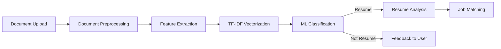

# 🚀 AI-Powered Resume Analyzer & Job Matcher

<div align="center">


</div>

<p align="center">
An intelligent ecosystem that <b>automatically distinguishes resumes from other documents</b> using custom machine learning models and connects candidates with their ideal opportunities.
</p>

<div align="center">

```
📄 → 🧠 → 📊 → 💼
Document → AI Analysis → Classification → Job Match
```

</div>

---

## ✨ Key Features

- **📝 Smart Resume Detection Engine** 
  - Custom ML classification models trained on diverse document datasets
  - Logistic Regression with TF-IDF vectorization for accurate document recognition
  - Microservice architecture for scalable resume identification

- **🔍 Intelligent Document Analysis**
  - Advanced NLP to extract skills, experience, and education from resumes
  - Entity recognition for professional qualifications and certifications
  - Temporal analysis of career progression and skill development

- **🔄 Strategic Job Matching**
  - Sophisticated algorithms to pair candidates with ideal positions
  - Weighted skill importance based on job market trends
  - Contextual understanding of role requirements

- **📈 Personalized Improvement Insights**
  - Gap analysis between candidate profile and target positions
  - Actionable recommendations for resume enhancement
  - Industry-specific optimization suggestions

---

## 🛠️ Tech Stack

<div align="center">

### ML & Document Classification


### Full Stack Application


### Microservices


</div>

---

## 📊 ML Resume Classification Process



---

## 📘 ML Model Architecture

Our resume classification system uses a sophisticated machine learning pipeline:

1. **Document Processing:**
   - Text extraction from multiple formats (PDF, DOCX, TXT)
   - Cleaning and normalization of text content

2. **Feature Engineering:**
   - TF-IDF vectorization with English stopwords removal
   - Feature selection targeting resume-specific vocabulary

3. **Classification Model:**
   - Logistic Regression optimized for document classification
   - Trained on diverse dataset of resumes and non-resume documents
   - Cross-validation for robust performance assessment

4. **Deployment:**
   - Microservice architecture using FastAPI
   - Containerized for consistent performance across environments
   - RESTful API for seamless integration with main application

---

## 🚀 Getting Started

### Prerequisites
- Python 3.8+
- Node.js & npm
- MongoDB

### Installation

1. Clone the repository
```bash
git clone https://github.com/yourusername/resume-analyzer.git
cd resume-analyzer
```

2. Set up the ML microservice
```bash
cd isResumeMicroservice
python -m venv venv
source venv/bin/activate  # On Windows: venv\Scripts\activate
pip install -r requirements.txt
```

3. Train the resume classifier model
```bash
python training/train_model.py
```

4. Start the resume detection service
```bash
python app.py
```

5. Install and run the main application
```bash
cd ../main-app
npm install
npm run dev
```

---

## 🔮 Future Enhancements

- **Enhanced ML Models:** Integration of transformer-based models for improved classification accuracy
- **Multi-language Support:** Extend resume detection to multiple languages
- **Document Structure Analysis:** Incorporate layout and formatting features for improved classification
- **Continuous Learning:** Implement feedback loops to improve model accuracy over time

---

<div align="center">

### Built with 💙 by Anmol Sharma


[](https://opensource.org/licenses/MIT)

</div>
